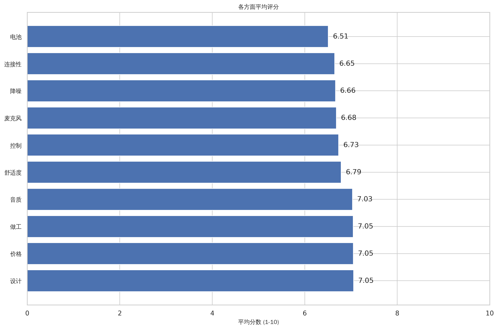
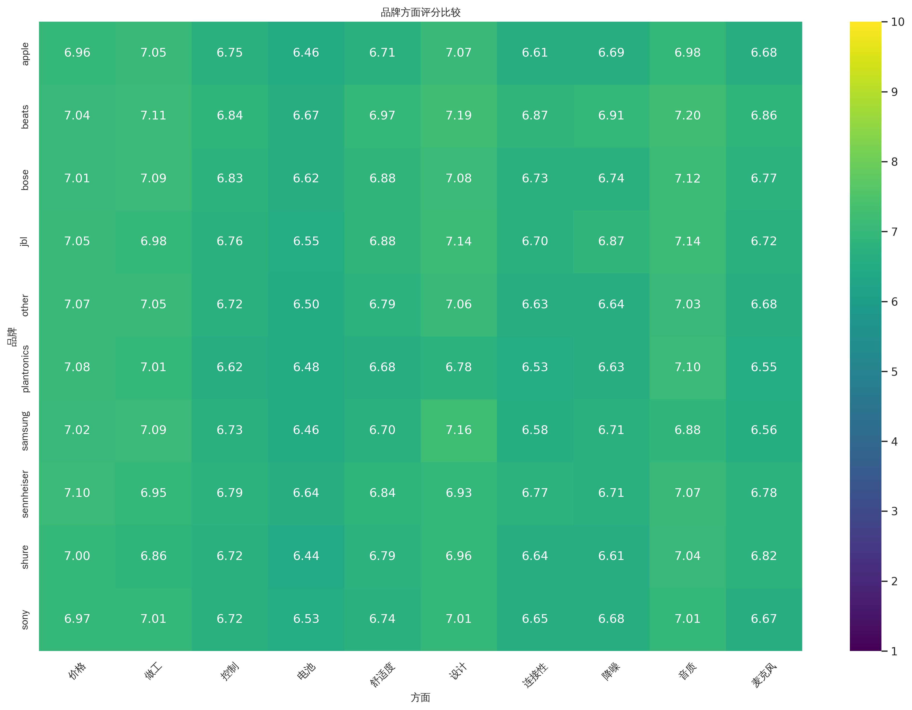
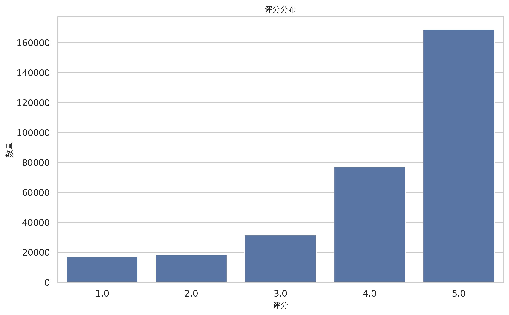

# README.md

# 🎧 音频产品评论分析与可视化平台

[](https://www.python.org/)
[](requirements.txt)
[](https://opensource.org/licenses/MIT) 
## 📝 项目简介

这是一个端到端的数据分析项目，旨在从海量的亚马逊电子产品评论中，自动筛选、处理和分析与音频设备（如耳机、音响）相关的用户反馈。项目利用自然语言处理（NLP）技术进行方面级情感分析（Aspect-Based Sentiment Analysis, ABSA），并提供多种可视化报告和两个交互式仪表盘，以揭示不同品牌、不同价位产品的优缺点。

## 目录

- [项目亮点](#-项目亮点)
- [技术栈](#-技术栈)
- [项目结构](#-项目结构)
- [安装与部署](#-安装与部署)
- [如何使用](#-如何使用)
- [静态仪表盘报告](#-静态仪表盘报告)
- [未来优化方向](#-未来优化方向)

## ✨ 项目亮点

* **数据预处理:** 清洗和规范化原始评论文本数据。
* **方面提取 (ABSA):** 基于关键词识别评论中提及的产品方面（例如 "音质", "电池", "舒适度"）。
* **自动化数据流水线**: 从数据获取、清洗、预处理、特征提取到可视化报告生成，实现一键式自动化运行。
* **深度方面情感分析 (ABSA)**: 不仅仅是判断评论的整体好坏，而是深入到**音质、舒适度、电池续航、连接性**等10个预设的核心方面，精准分析用户在每个具体方面的真实情感。
* **多维度数据洞察**: 对比分析不同品牌、不同价格区间产品的表现差异，为市场分析和产品决策提供数据支持。
* **丰富的可视化**:
    * **静态报告**: 自动生成包括评分分布、方面评分雷达图、品牌比较热力图、词云在内的多种可视化图表。
    * **交互式仪表盘**: 提供两个基于 Streamlit 的动态仪表盘，分别面向数据分析师和普通消费者，满足不同用户的探索需求。
* **商业智能 (BI) 兼容性**: 支持将最终分析结果导出为适配 Power BI / FineBI 等主流BI工具的数据模型。


## 🛠️ 技术栈

* **数据处理与分析**: Pandas, NumPy
* **自然语言处理 (NLP)**: NLTK, spaCy
* **数据可视化**: Matplotlib, Seaborn, Plotly, WordCloud
* **交互式Web应用**: Streamlit
* **核心开发语言**: Python 3.12

## 📂 项目结构
```bash
audio_review_analysis/
├── .gitignore
├── DETAILED_DOCS.md
├── OPTIMIZATION.md
├── README.md
├── USER_GUIDE.md
├── config.py
├── consumer_dashboard.py
├── dashboard.py
├── generate_static_dashboard.py
├── main.py
├── requirements.txt
├── data/
│   ├── processed/
│   │   ├── audio_reviews.csv
│   │   ├── processed_audio_reviews.csv
│   │   └── review_aspects.csv
│   └── raw/
├── outputs/
│   ├── figures/
│   │   ├── (存放所有 .png 和 .html 格式的图表)
│   └── html_dashboard/
│       ├── dashboard.html  (静态仪表盘主文件)
│       └── ... (其他图表的 .html 文件)
└── src/
    ├── data/
    │   ├── acquisition.py
    │   └── preprocessing.py
    ├── export/
    │   └── powerbi_export.py
    ├── features/
    │   └── aspect_extraction.py
    └── visualization/
        └── plots.py
```

## ⚙️ 安装与部署

1.  **克隆仓库:**
    ```bash
    git clone [https://github.com/Eastr5/audio_review_analysis.git](https://github.com/Eastr5/audio_review_analysis.git)
    cd audio_review_analysis
    ```
2.  **创建并激活虚拟环境 (推荐):**
    ```bash
    python -m venv venv
    # Windows
    venv\Scripts\activate
    # macOS/Linux
    source venv/bin/activate
    ```
3.  **安装依赖:**
    ```bash
    pip install -r requirements.txt
    ```

**4. 下载NLP模型**

首次运行时，部分NLP模型可能需要手动下载。如果自动下载失败，请执行以下命令：

```bash
# 安装 spaCy 英文模型
pip install [https://ghproxy.com/https://github.com/explosion/spacy-models/releases/download/en_core_web_sm-3.7.1/en_core_web_sm-3.7.1-py3-none-any.whl](https://ghproxy.com/https://github.com/explosion/spacy-models/releases/download/en_core_web_sm-3.7.1/en_core_web_sm-3.7.1-py3-none-any.whl)

# 下载 NLTK 数据
python -c "import nltk; nltk.download('vader_lexicon'); nltk.download('punkt'); nltk.download('stopwords')"
```

**5. (可选) 安装中文字体**

为了让 Matplotlib 生成的静态图表能正确显示中文，建议在 Linux 系统上安装中文字体。

```bash
sudo apt-get update && sudo apt-get install -y fonts-wqy-zenhei fontconfig
```    

## 🚀 使用说明

1.  **准备数据:**
    * **使用样本数据 (推荐首次运行):** 项目在 `data/raw/` 目录下提供了一个小型的匿名样本文件 `sample_audio_reviews_raw.csv`。`config.py` 默认可能指向这个样本文件，或者你需要修改 `config.py` 中的 `RAW_REVIEWS_FILE` 指向它。
    * **使用你自己的数据:** 将你的原始评论 CSV 文件放入 `data/raw/` 目录，并确保其列名与项目预期一致（至少包含 `review_id`, `review_text`, `rating`, `brand`, `price`）。然后修改 `config.py` 中的 `RAW_REVIEWS_FILE` 指向你的文件名。

2.  **运行分析流程:**
    * 在项目根目录下运行 `main.py` 脚本。这将执行数据预处理、方面提取、可视化图表生成和 BI 数据导出。
    * ```bash
        python main.py
        ```
    * 处理后的数据将保存在 `data/processed/`，图表和导出数据将保存在 `outputs/`。

3.  **启动仪表板:**

    本项目包含两个仪表盘：

    * **专业版仪表盘 (`dashboard.py`)**: 功能全面，适合数据分析。
        ```bash
        streamlit run dashboard.py
        ```
    * **消费者版仪表盘 (`consumer_dashboard.py`)**: 界面简洁，适合快速查阅。
        ```bash
        streamlit run consumer_dashboard.py
        ```

## 📊 仪表板演示
如果您不想在本地运行 Python 环境，我们还提供了一份预先生成的、半交互式的静态HTML仪表盘报告。您可以直接在浏览器中打开查看核心的分析结果。

* **报告中的图表是可交互的** (可以悬停查看数据、缩放等)。
* **报告不支持全局筛选功能**，如需完整体验，请运行上面的 Streamlit 仪表盘。

**图片预览**





**[➡️ 点击此处，查看离线仪表盘报告](outputs/html_dashboard/dashboard.html)**

## 🔮 未来优化方向

* **单元测试**: 为核心函数（如数据清洗、情感计算）添加单元测试，保证代码质量和稳定性。
* **日志系统**: 使用 `logging` 模块替代 `print` 语句，实现更规范的日志记录和管理。
* **性能优化**: 对于大数据集，可以考虑使用 Dask 或 Polars 替代 Pandas，或使用 Spark 进行分布式计算。
* **模型优化**: 尝试使用更先进的预训练模型（如 BERT）进行情感分析，以获得更高的准确度。
* **容器化**: 使用 Docker 将整个应用打包，简化部署流程，保证环境一致性。

## 🤝 贡献

欢迎提出改进意见或贡献代码！请通过 GitHub Issues 或 Pull Requests 进行。


## 📄 许可

本项目采用 [MIT License](LICENSE) 授权。 ```


